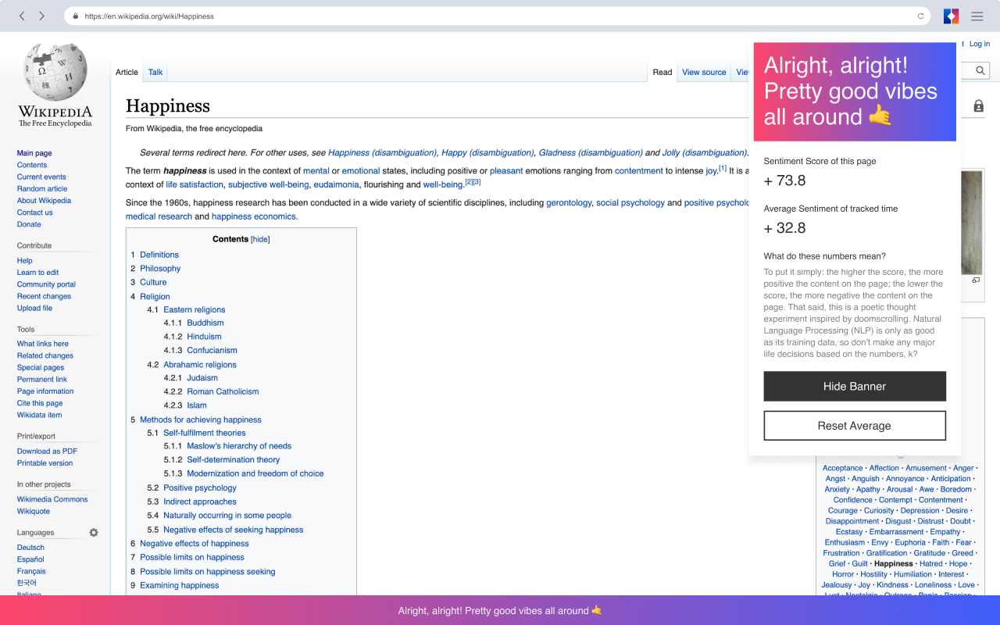

# Vibes
## About Vibes

Vibes is a poetic response to doomscrolling. This browser extension (optimized for chrome), takes your browsing activity and runs it through a sentiment analysis library in order to tell you whether or not your content is affecting your mood. The piece serves as a commentary both on doomscrolling culture but also on affective computing and its touted accuracy/inaccuracy. The output is not always accurate and can often serve as a simplistic reflection on human culture and nuance.




## Install

Clone the repo and install the dependencies using [yarn](https://yarnpkg.com/en/docs/install#mac-stable).

```bash
git clone git@github.com:rarar/Vibes.git
cd Vibes/
yarn install
```

## Develop

To develop locally, a `dist` folder is created and the `src/manifest.json` is copied over, in addition to other files in the `src` folder.

```bash
yarn dev
```

## Build

To build the library, the `dist` folder is cleaned before the project is built. Building for production excludes the `src/tests/` folder and minifies the final output.

```bash
yarn build
```

### Previewing the Extension in Chrome

1. Run the `yarn build` command

The `dist` folder should be generated and contain the files required for loading an unpacked extension.

2. Navigate to `chrome://extensions/`

3. Click "Load unpacked" and select the `dist` folder

The extension should appear as a new card.

4. In the extension card, click "background page" to open a Chrome developer console for the extension. Click on a different Chrome tab; the extension should be run and you should see the output in the developer console.
